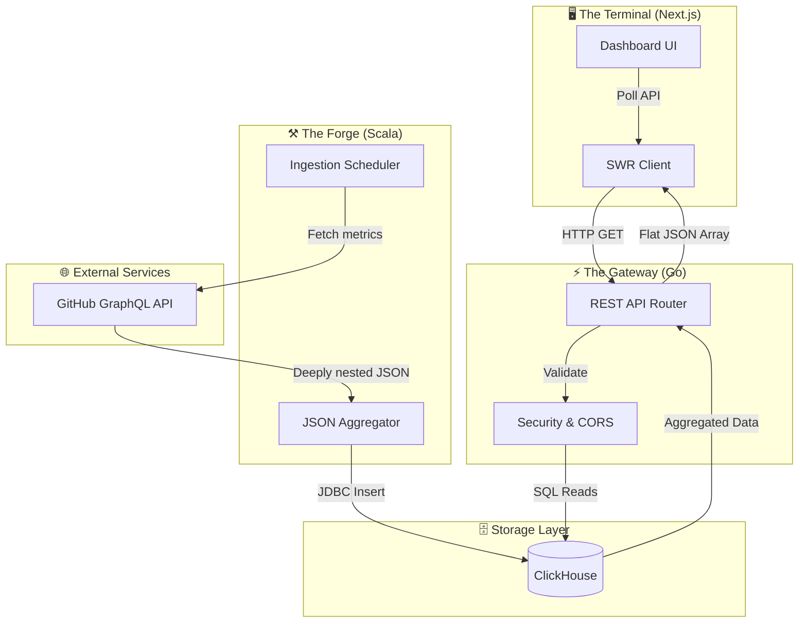

# 🛰️ OmniStat — Polyglot Telemetry & Observability Engine
**Full-Stack · Polyglot Microservices · Data Ingestion · Analytics · Dashboard**

---

## 📌 Overview

**OmniStat** is a polyglot, self-hosted telemetry and observability engine designed to provide comprehensive visibility into your development lifecycle. 

Unlike standard static profile stats, OmniStat acts as a **background intelligence pipeline**. It continuously mines repository activity, reduces massive datasets into behavioral metrics, and projects that data onto a modern, responsive dashboard.

> OmniStat is designed as a **complete analytical engine**, tracking not just *what* you build, but *how* you build.

---

## 🚀 Why OmniStat?

Standard analytics tools stop at basic commit counts and line changes. **OmniStat goes further.**

### Key Highlights
- ✅ **Polyglot Architecture:** Distinct layers built in Scala, Go, and Next.js.
- ✅ **Absolute Language Tracking:** Analyzes exact byte distribution across your entire codebase portfolio.
- ✅ **Temporal Heatmapping:** Identifies "Golden Hours" by correlating commit density with time and day.
- ✅ **Type-Safe Boundaries:** Ensures complex data structures processed in the JVM are perfectly mirrored in TypeScript via Go.
- ✅ **High-Performance Storage:** Powered by ClickHouse for analytical scaling and lightning-fast reads.


---

## 🏗️ Full System Architecture

OmniStat is designed around a decoupled architecture specifically engineered to handle the distinct computing demands of data extraction, fast-path API delivery, and low-latency rendering. 



---

## 🔁 The Trinity Architecture

By splitting the system into three tiers, we avoid the trade-offs of a single-language stack. Each tier operates as an isolated micro-engine optimized for its specific runtime role.

---

## ⚙️ Layer 1 — The Forge (Data Ingestion)

**Technology:** `Scala`

The ingestion layer’s primary job is to deal with unpredictable external payloads, manage complex data maps, and guarantee data consistency before storage.

### Why Scala?
- **Complex GraphQL Processing:** The GitHub API returns deeply nested JSON. Scala’s pattern matching and `circe` library map these into strictly typed case classes with zero runtime null-pointer risks.
- **Pure Functional Transformations:** Scala’s functional collections execute deterministic map-reduce operations reliably for calculating complex metrics like byte-level code churn.
- **Type-Safe Persistence:** Database mappers ensure complex structural data maps perfectly to ClickHouse without runtime casting failures.

**Flow:**
`Cron Schedule` → `GitHub GraphQL API` → `Immutable Reductions` → `Secure Upsert (ClickHouse)`

---

## ⚡ Layer 2 — The Gateway (API Proxy)

**Technology:** `Go`

Once the heavy computational lifting is finished by Scala, the web client should not wait on a heavy JVM runtime just to read a database row.

### Why Go?
- **High Speed & Low Footprint:** Go compiles to a highly efficient native binary. Its `net/http` server handles database reads and serves JSON with microsecond latencies using minimal RAM.
- **Backend-for-Frontend (BFF):** Go acts as a protective shield and custom data adapter. It abstracts the database layout, strips out sensitive information, and formats data for Next.js ingestion.
- **Concurrency at the Edge:** Go's goroutines smoothly multiplex incoming connections without blocking the main event thread, perfect for real-time dashboard streams.

**Flow:**
`Next.js Request` → `API Router` → `Streamlined Query (ClickHouse)` → `Flat JSON Array` → `Response`

---

## 🖥️ Layer 3 — The Terminal (Visualization)

**Technology:** `Next.js`

For a data-heavy frontend dashboard, performance and layout flexibility are paramount.

### Why Next.js?
- **Hybrid Rendering:** SSR and ISR render historical statistics instantly on page load. Live components hydrate on the client using React hooks and `SWR`.
- **Component Modularity:** Complex interfaces (language radars, heatmaps) are broken into highly reusable React components.
- **Rapid Layouts:** Tailwind CSS provides utility-first styling for responsive, modern layouts without cascading bugs.

---

## 🛠️ Setup & Deployment

> [!IMPORTANT]
> **OmniStat** requires a GitHub Personal Access Token with `repo` and `read:user` scopes. The architecture relies on **ClickHouse** running locally (or remotely). Ensure the following environment variables are set before spinning up:
> 
> ```bash
> export GITHUB_TOKEN="your_token_here"
> export CLICKHOUSE_HOST="localhost:9000"
> export CLICKHOUSE_USER="default"
> export CLICKHOUSE_PASSWORD=""
> ```

### Run All Services
```bash
make dev
```

### Manual Execution

**1. The Forge** (Ingestion):
```bash
cd data && sbt run
```

**2. The Gateway** (API Proxy):
```bash
cd backend && go run cmd/api/main.go
```

**3. The Terminal** (Frontend):
```bash
cd frontend && npm run dev
```

---

## ✅ Test Matrix

| Layer | Language | Tests | Runner |
|-------|----------|-------|--------|
| The Forge | Scala | 32 | `cd data && sbt test` |
| The Gateway | Go | 28 | `cd backend && go test ./...` |
| The Terminal | TypeScript | 17 | `cd frontend && npm test` |
| **Total** | **3** | **77** | — |

> All test files are symlinked into [`tests/`](tests/) for a unified view.

---

## 🎯 Project Roadmap
- [x] **Phase 1**: Polyglot Telemetry Core Setup.
- [x] **Phase 2**: Data Ingestion Layer & Backend.
- [x] **Phase 3**: Frontend UI Foundations.
- [ ] **Phase 4**: Feature Implementation & Dashboard Integration.
- [ ] **Phase 5**: Full-Stack Polish.

*(C) 2026 pd241008*
