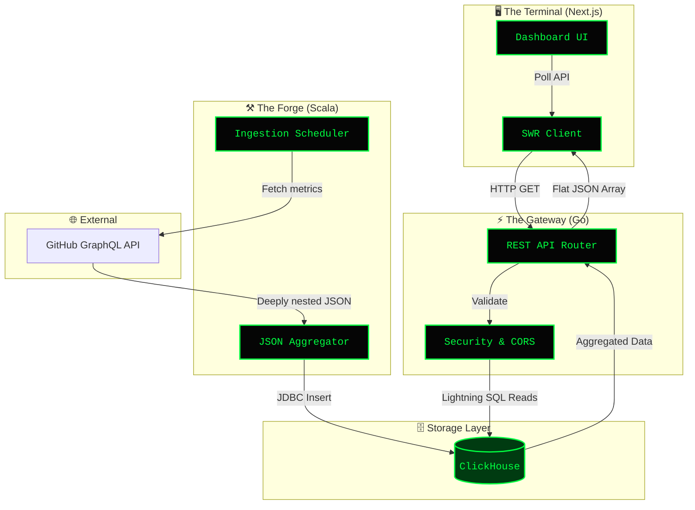

# 🛰️ OmniStat

> **OmniStat** is a polyglot, self-hosted telemetry and observability engine designed to provide total, unblinking visibility into your development lifecycle.


Far beyond standard profile stats, OmniStat acts as a background intelligence pipeline. It continuously mines both public and private repository activity, reduces massive datasets into behavioral metrics, and projects that data onto a highly stylized, strict-terminal HUD.

OmniStat is designed around a decoupled, polyglot architecture specifically engineered to handle the distinct computing demands of data extraction, fast-path API delivery, and low-latency rendering. By splitting the system into The Forge (Scala), The Gateway (Go), and The Terminal (Next.js), you avoid the trade-offs of a single-language stack. Each tier operates as an isolated micro-engine optimized for its specific runtime role.

---

## 🏛️ The Architectural Design & Technical "Whys"



### 1. ⚒️ The Forge (Data Ingestion) — Why Scala?
The ingestion layer’s primary job is to deal with unpredictable external payloads, manage complex data maps, and guarantee data consistency before storage.

- **Complex GraphQL Processing:** The GitHub GraphQL API returns deeply nested, highly structural JSON. Scala’s pattern matching and robust JSON library (`circe`) allow you to parse, transform, and map these deeply nested graphs into strictly typed case classes with minimal boilerplate and zero runtime null-pointer risks.
- **Pure Functional Transformations:** When calculating complex behavioral metrics like "temporal velocity matrices" or "byte-level code churn," you are performing complex data reductions. Scala’s functional collection methods allow you to execute deterministic map-reduce operations reliably.
- **Type-Safe Persistence:** Using type-safe database mappers ensures that the complex structural data parsed from the JVM maps perfectly to our ClickHouse schemas without runtime type casting failures.

### 2. ⚡ The Gateway (API Proxy) — Why Go?
Once the heavy, computational lifting of extracting and aggregating data is finished by Scala, you do not want your web client waiting on a heavy JVM runtime just to read a database row.

- **Blistering Speed & Low Footprint:** Go compiles to a single, highly efficient native binary. Its HTTP server routing (`net/http`) handles database reads and serves JSON payloads with microsecond latencies while consuming a fraction of the RAM that Scala or Node.js would need.
- **The Backend-for-Frontend (BFF) Pattern:** Go acts as a protective shield and custom data adapter for the frontend. It abstracts the database layout, strips out sensitive information, and formats data specifically for Next.js UI ingestion.
- **Concurrency at the Edge:** As the dashboard expands to stream real-time updates or handle multiple concurrent sessions, Go's goroutines can multiplex incoming WebSocket connections or long-polling streams smoothly without blocking the main event thread.

### 3. 🖥️ The Terminal (Visualization Dashboard) — Why Next.js?
For a ctOS-inspired, immersive terminal aesthetic, performance and layout flexibility are paramount.

- **Hybrid Rendering (SSR/ISR):** Next.js lets you use Server-Side Rendering (SSR) or Incremental Static Regeneration (ISR) to render historical dashboard statistics instantly on page load. Live, streaming components (like the simulated typewriter feed) then hydrate on the client using React hooks and data-fetching utilities like `SWR`.
- **Component Modularity:** Complex visualization interfaces (language radars, temporal heatmaps, grid matrices) can be broken into reusable React components.
- **Rapid Neo-Brutalist Layouts:** Tailwind CSS provides utility-first configuration, making it incredibly clean to enforce strict monospace typography, exact phosphor green borders, absolute pixel-aligned layouts, and dark terminal states without fighting cascading stylesheet bugs.

---

## 🛰️ Core Data Pipelines

Here is how data flows sequentially through the trinity infrastructure:

```mermaid
flowchart TD
    API[GitHub GraphQL API] -->|Cron Schedule Ingestion| Forge
    
    subgraph ForgeEngine [⚒️ THE FORGE (Scala Engine)]
        direction TB
        F1[- Fetches raw structural JSON graphs]
        F2[- Performs immutable reductions]
        F3[- Validates byte metrics & timelines]
    end
    Forge --> ForgeEngine
    
    ForgeEngine -->|Secure Upsert| DB[(ClickHouse Columnar Storage)]
    
    DB -->|Low-latency Read Queries| Gateway
    
    subgraph GatewayAPI [⚡ THE GATEWAY (Go API BFF)]
        direction TB
        G1[- Proxies database query paths]
        G2[- Massages relational rows into UI arrays]
        G3[- Implements rate-limiting/security]
    end
    Gateway --> GatewayAPI
    
    GatewayAPI -->|Streaming/SWR REST Fetch| Terminal
    
    subgraph TerminalHUD [🖥️ THE TERMINAL (Next.js Dashboard)]
        direction TB
        T1[- Renders Server-Side Layouts]
        T2[- Animates cyber-HUD dashboard views]
    end
    Terminal --> TerminalHUD
```

* **Ingestion & Aggregation Pipeline:** The Scala worker executes on a timed routine. It queries the GitHub API for complete commit node history, pulls file-blob data sizes to determine precise language byte changes, and batches these changes into temporal buckets. This aggregated, clean metric dataset is written straight to ClickHouse for analytical scaling.
* **Delivery & Security Pipeline:** When the Next.js frontend dashboard opens, it fires off parallel client API requests. The Go Gateway picks up these requests, pulls the pre-aggregated data out of ClickHouse using streamlined queries, and instantly shapes it into flat arrays optimal for data visualization charts.
* **Hydration & Render Pipeline:** Next.js receives the clean Go API data. Static elements generate instantly, while specific metric displays use client-side hydration to pipe the array data directly into interactive, neon-styled charts, generating the terminal interface.

---

## ⚡ Key Capabilities

- 📊 **Absolute Language Tracking:** Analyzes exact byte distribution across the entire codebase portfolio, exposing true stack proficiency.
- 🕒 **Temporal Heatmapping:** Identifies "Golden Hours" by correlating commit density with specific times of day and days of the week.
- 📟 **Live-Stream Introspection:** Visualizes recent codebase actions in a simulated, typewriter-effect terminal feed.
- 🛡️ **Type-Safe Boundaries:** Ensures complex data structures processed in the JVM (Scala) are perfectly mirrored in the TS environment via the Go intermediary.

---

## 🛠️ Setup & Deployment

> [!IMPORTANT]
> **OmniStat** requires a GitHub Personal Access Token with `repo` and `read:user` scopes to function. The architecture relies on **ClickHouse** running locally (or remotely). Ensure the following environment variables are set before spinning up:
> 
> ```bash
> export GITHUB_TOKEN="your_token_here"
> export CLICKHOUSE_HOST="localhost:9000"
> export CLICKHOUSE_USER="default"
> export CLICKHOUSE_PASSWORD=""
> ```

### Run All Services
```bash
make dev
```

### Manual Execution

**1. The Forge** (Ingestion):
```bash
cd data && sbt run
```

**2. The Gateway** (API Proxy):
```bash
cd backend && go run cmd/api/main.go
```

**3. The Terminal** (Frontend):
```bash
cd frontend && npm run dev
```

---

## 🎯 Project Roadmap
- [x] **Phase 1**: Polyglot Telemetry Core Setup.
- [x] **Phase 2**: Data Ingestion Layer & Backend.
- [x] **Phase 3**: Frontend UI Foundations.
- [ ] **Phase 4**: Feature Implementation & Dashboard Integration.
- [ ] **Phase 5**: Full-Stack Polish.

*(C) 2026 pd241008 
